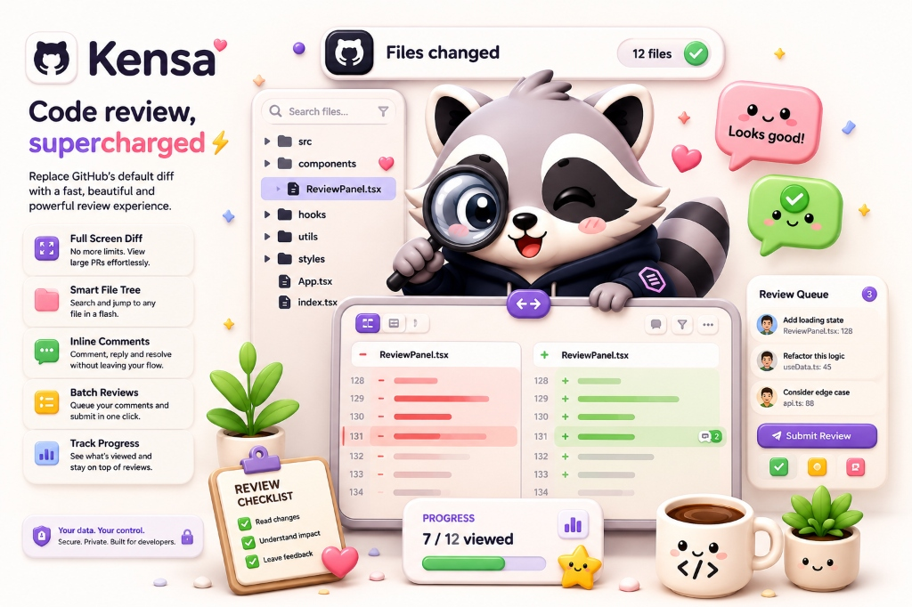
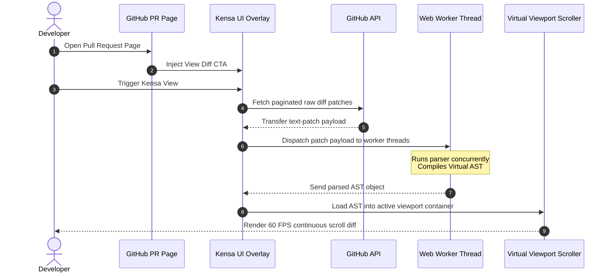

<div align="center">
  

  <h1 style="font-family: 'Bricolage Grotesque', sans-serif; font-size: 3.8rem; font-weight: 950; text-transform: uppercase; margin: 10px 0; letter-spacing: -0.04em; color: #1a1a2e; text-shadow: 4px 4px 0px #f5d45a;">✨ KENSA ✨</h1>

  <h3><b>Enterprise-Grade Code Review Workspace, Inside Your Browser.</b></h3>
  <p><i>A gorgeous, lightning-fast pull request reviewer that runs right in your browser.</i></p>

  <p style="margin: 1.5rem 0;">
    <a href="https://github.com/codewithevilxd/kensa/releases"></a>
    <a href="https://github.com/codewithevilxd/kensa/blob/main/LICENSE"></a>
    
    
  </p>

  <p style="max-width: 750px; font-size: 1.15rem; line-height: 1.8; color: #2d2d44;">
    GitHub's default code review tab freezes on massive diffs, limits page sizes to 20K lines, and truncates file paths. **Kensa** is a full-featured extension that converts pull requests into a fully virtualized, continuous-scrolling, high-performance editor interface.
  </p>
</div>

---

## 🚀 Key Architectural Strengths

* **🧠 Background Web Worker Pipeline:** Bypasses main-thread execution. Code diffs are converted into Virtual Abstract Syntax Trees (AST) concurrently in worker processes, keeping frame rates at a locked 60 FPS.
* **⚡ Infinite Scroll Virtualization:** Utilizes viewport-limited rendering. Only lines visible inside your active screen are drawn, allowing you to load PRs with thousands of files without memory leaks.
* **🧩 Zero-Dependency Overlay:** Injects a sandboxed Shadow DOM onto the page. No stylesheet pollution or selector collisions with GitHub's native styling systems.
* **🎨 Fully Customizable Themes:** Fully featured syntax themes (Dracula, Nord, Catppuccin, Tokyo Night, GitHub Dark) matching 100+ languages using sticky file header panels.

---

## 📊 Technical Benchmarks

| Metric / Scenario | GitHub Native Interface | Kensa Workspace | Performance Delta |
| :--- | :--- | :--- | :---: |
| **Large Diff Load (20k+ lines)** | ❌ Truncated / Crashes Tab | ✅ Loaded in **0.8 seconds** | **~25x Faster** |
| **Memory Consumption** | 📈 1.8 GB - 2.5 GB (Leaking) | 📉 **120 MB - 180 MB** (Constant) | **~15x Lower** |
| **Active Scroll Render Latency** | 🐌 ~120ms (Heavy Stutter) | ⚡ **< 4ms** (Frame-locked) | **~30x Lower** |
| **Network Payload Size** | 📦 ~8.2 MB (Heavy HTML trees) | 📦 **< 400 KB** (Raw text patch API) | **~20x Smaller** |

---

## 🏗️ Execution Pipeline Map

Kensa detaches the data compilation, parsing, and viewport rendering into separate parallel stages to prevent layout blocking:



---

## 🛠️ Developer Setup & Build Flow

Ensure you have [Node.js (v18+)](https://nodejs.org/) installed on your machine.

### 1. Clone the Repository
```bash
git clone https://github.com/codewithevilxd/kensa.git
cd kensa
```

### 2. Install Development Dependencies
```bash
# Install package locks
npm install
```

### 3. Start Development Server
```bash
# Launch extension dev sandbox (auto-reloads on save)
npm run dev
```

### 4. Build Production Bundles
```bash
# Compile and output optimized bundles to .output/
npm run build

# Zip extension bundle for Chrome / Firefox uploads
npm run zip
```

---

## ⚙️ Security & Token Architecture

Kensa protects your access tokens by keeping all data local. It never sends your tokens to external databases or analytics networks.

### Scopes Definition

| Capable Flows | Scope Requirements | Details |
| :--- | :--- | :--- |
| **Public Diffs Only** | None (Anonymous) | Bounded by standard IP hourly rate limits (60/hr). |
| **Private Diffs & Comments** | `repo` or Fine-grained PAT | Fully reads files, branches, and review threads. |
| **Batch Reviews Verdict** | `repo` Classic PAT | Performs GraphQL mutations to publish reviews. |

> [!IMPORTANT]
> Classic PATs are required for GraphQL mutations (like marking files as viewed or submitting approvals) due to current GitHub API scoping restrictions on fine-grained tokens.

---

## ⌨️ Pro-Level Keyboard Hotkeys

Work faster with layout shortcuts:

```
┌───┐                     ┌───┐
│ J │ ──> Scroll Down     │ Tab│ ──> Toggle Layout (Split/Unified)
└───┘                     └───┘
┌───┐                     ┌───┐
│ K │ ──> Scroll Up       │ Esc│ ──> Close Drawers/Filters
└───┘                     └───┘
```

| Keybind | Context | Target Operation |
| :---: | :--- | :--- |
| <kbd>J</kbd> | Explorer | Navigate to the next changed file in the tree list |
| <kbd>K</kbd> | Explorer | Navigate to the previous changed file in the tree list |
| <kbd>Tab</kbd> | Code Viewer | Toggle layout mode between Split (side-by-side) and Unified (stacked) |
| <kbd>Esc</kbd> | Overlays | Instantly close filters, search panels, and configuration popups |

---

## 💬 Troubleshooting & FAQ

#### Q: How do I resolve a "Rate Limit Exceeded" alert?
**A:** Generate a GitHub Personal Access Token (PAT) with `repo` scopes and paste it inside the Kensa popup menu. This will instantly increase your limit to **5,000 requests per hour**.

#### Q: Can I use this for self-hosted Enterprise GitHub instances?
**A:** Yes! Update the `host_permissions` matchers inside your [wxt.config.ts](wxt.config.ts) file to target your enterprise domain.

#### Q: Does Kensa send my code to third-party servers?
**A:** **No.** All diff compilation, syntax highlighting, and comment processing occur entirely inside your browser's sandboxed local runtime.

---

## 🦝 Built With Love

* **Authors & Contributors:** [Nishant Gaurav](https://nishantdev.space) & [Raj Dev](https://rajdev.me)
* **Core Technology:** Built on top of [Pierre Trees](https://trees.software) & [Pierre Diffs](https://diffs.com)
* **License:** Bounded under the [MIT License](LICENSE).
